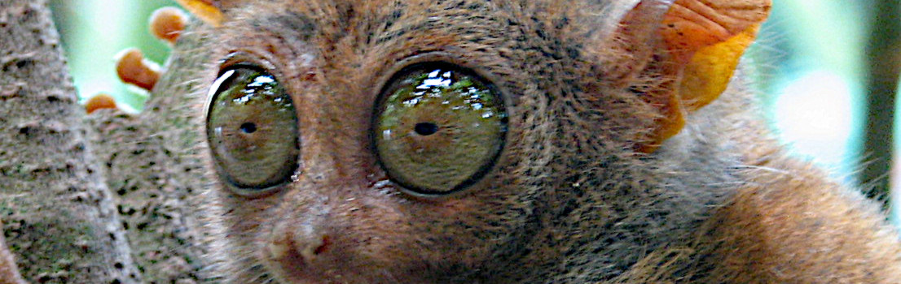
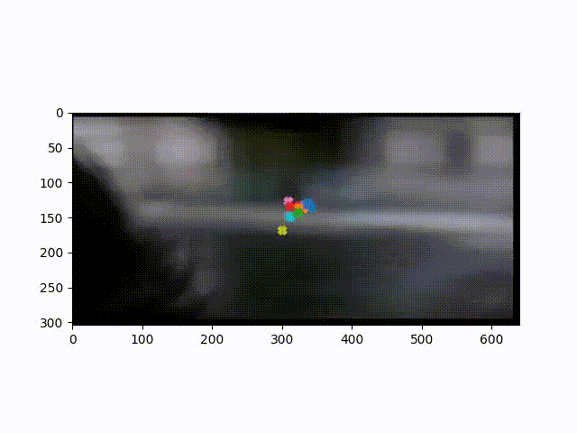

# vision-toolkit

> You can check the docs at https://v01dxyz.github.io/vision-toolkit <!-- FOR_README_ONLY -->

`vision-toolkit` is a Python package for processing eye tracking data and extract from them:

- Scanpaths: A macro trajectory of the gaze without taking into account 
    all the little movements of the eyes around what they see
- Areas of Interest: Zones the viewer is attracted to.

Below a video from one of testing datasets showing multiple viewers watching a movie scene:

`vision-toolkit` supports:

- coordinates on an screen: cartesian and angular ones
- point of gaze: a three dimension vector, often from an estimation using both eyes

This work was done by Quentin Laborde as an extension to his PhD and
Robert Dazi for industrializing the package development, both as part
of Centre Borelli from ENS Paris-Saclay.
